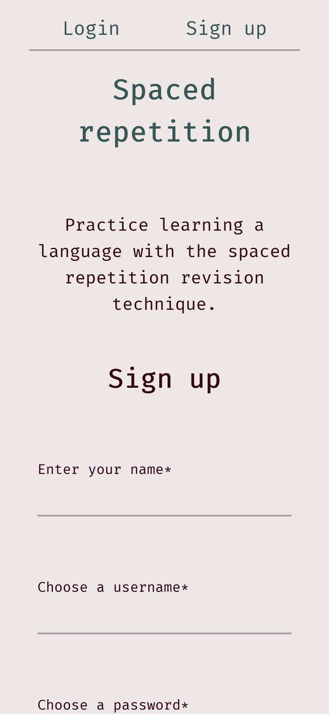
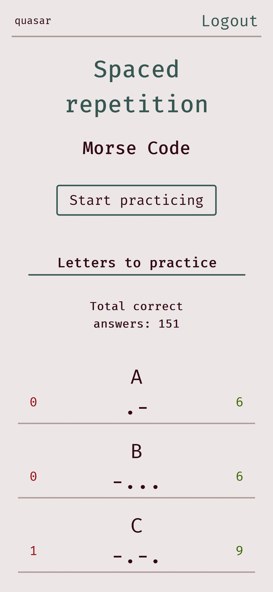
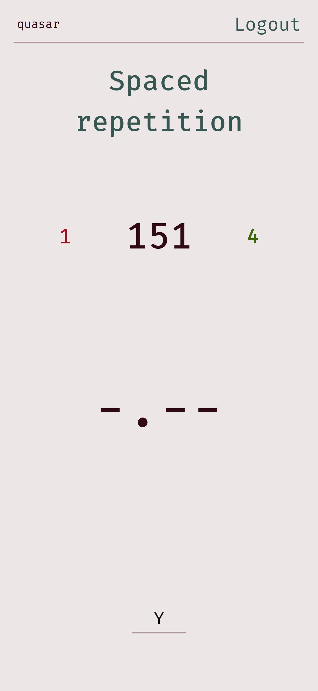
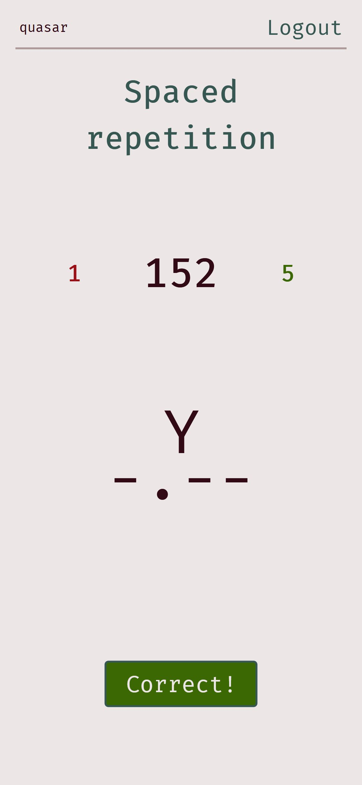

# Spaced repetition - Learn Morse Code
[Live App](https://m-o-r-s-e.now.sh/)  
Demo username: admin  
Demo password: pass  
[Client Repo](https://github.com/thinkful-ei-gecko/quasar-nandana-spaced-repetition-client)  
[API Repo](https://github.com/thinkful-ei-gecko/quasar-nandana-spaced-repetition-server)  

## Screenshots

   

<!-- 

 -->

## Summary
This uses spaced repetition to help people learn Morse Code. The app will display the alphabet in Morse code, and ask you to recall the alphabetic representation for each encoded letter.

## Tech
This is a full-stack web-app.  
Front-end: React.js, SCSS  
Back-end: Node.js, Express.js, knex, PostGreSQL, RESTful API  